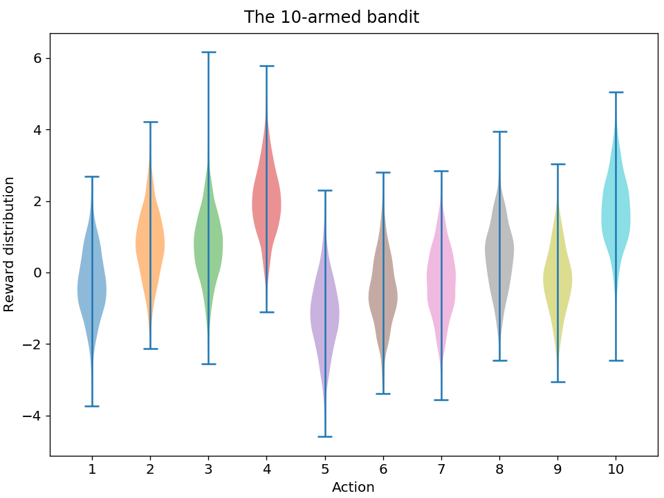
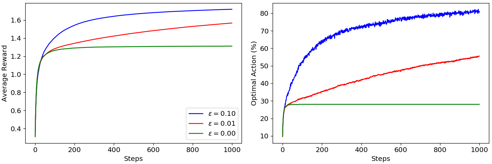
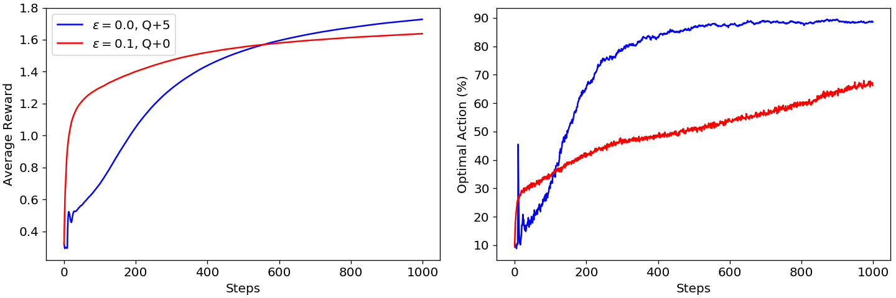
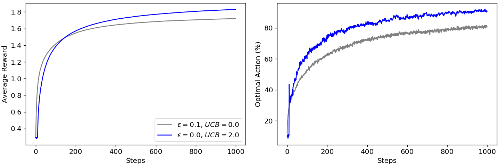

# RLearning

Code being developed while studying the book "Reinforcement Learning: An Introduction", by Richard A. Sutton and Andrew G. Barto.

## Chapter 2: Multi-armed Bandits

Some results for the <i>"sample-averaged"</i>, <i>&epsilon;-greedy</i> 10-armed bandit model are presented below:

     
    <b>Figure 2.1.</b> Rewards for each action in a 10-armed bandit.

     
    <b>Figure 2.2.</b> Results from 2000 runs of 1000 steps each for varying &epsilon; values.

     
    <b>Figure 2.3.</b> Results from 2000 runs of 1000 steps each. <b>Blue:</b> greedy steps with optimistic initial values; <b>Red:</b> &epsilon;-greedy steps.

     
    <b>Figure 2.4.</b> Results from 2000 runs of 1000 steps each. <b>Blue:</b> upper-confidence bound greedy steps; <b>Grey:</b> &epsilon;-greedy steps.

