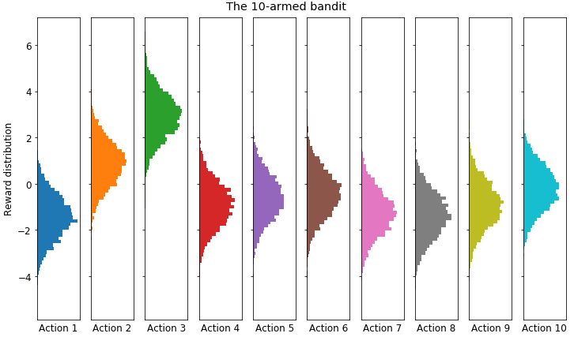
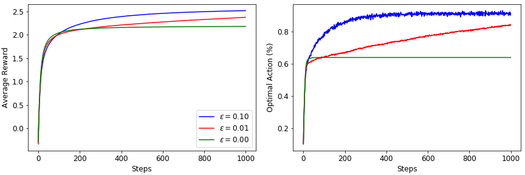

# RLearning

Code being developed while studying the book "Reinforcement Learning: An Introduction", by Richard A. Sutton and Andrew G. Barto.

## Chapter 2: Multi-armed Bandits

Results for the k-armed bandit model are presented below:

    
    
Figure 2.1. A randomized 10-armed bandit. Each action rewards according to a gaussian distribution.

    
    
Figure 2.2. Results from 2000 runs of 1000 steps each for varying &epsilon; values.

